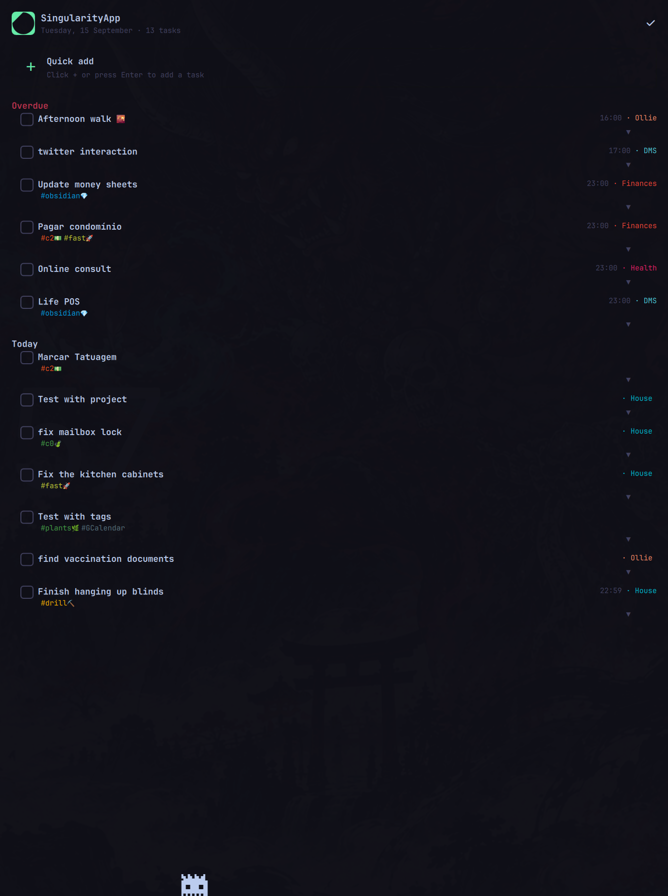
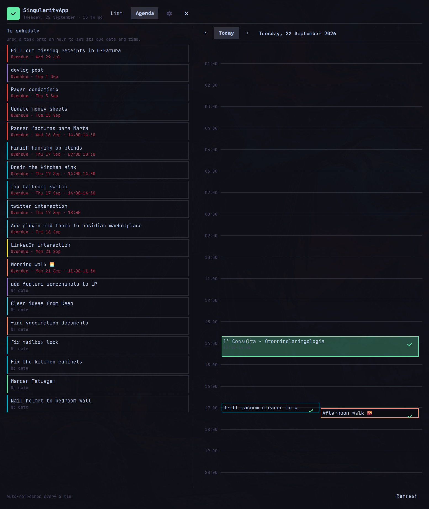

# SingularityApp Plugin for [Omarchy](https://omarchy.org)

```text
         .
      \  |  /
   ---- ◉ ----
      /  |  \
         '
```

**View and manage SingularityApp tasks from the [Omarchy](https://omarchy.org) bar.** Wears every [Omarchy](https://omarchy.org) theme.




## Overview

The SingularityApp plugin integrates [SingularityApp](https://singularity-app.com) with your [Omarchy](https://omarchy.org) workflow. It provides:

- **Bar widget**: Shows today's open task count in the Omarchy bar
- **Floating panel**: A List tab for daily task planning and an Agenda tab for drag-and-drop scheduling
- **API integration**: Connects to the SingularityApp v2 REST API

## Features

### Bar Widget

- Displays task count as an icon in the [Omarchy](https://omarchy.org) bar
- Click to open the task panel
- Right-click to toggle the panel
- Tooltip shows task count or status
- Shows "no tasks" / "loading" / "no API token" states

### List Tab

- **Overdue / Today / No date** groups, each sorted by due date and time
- Every task row shows its due date (or "Overdue · <date>") and time, e.g. `Overdue · Tue 15 Sep · 09:00`
- **Quick add** form with title, note, project, tags, priority, date, and time
- **Task actions** per row:
  - Complete/Reopen checkbox
  - Expand/collapse button
  - Priority color coding
- **Expanded task view** with action buttons:
  - Done/Reopen
  - Tomorrow (postpone)
  - Cancel task
  - Schedule at specific time
  - Delete task
- **Project and tag** display

### Agenda Tab

- A day timeline in 1-hour blocks, with a "To schedule" sidebar listing undated, overdue, or time-less tasks
- **Drag a task from the sidebar onto an hour** to set its due date and hour in SingularityApp
- **Drag an existing block to a new hour** to reschedule it
- Overlapping tasks lay out in side-by-side lanes; the current time is marked on today's timeline
- Previous/Next/Today navigation between days

### API Integration

- Polls `https://api.singularity-app.com/v2` for tasks
- Supports Bearer token authentication
- Requests go through `curl` under an end-to-end deadline (curl `--max-time 20`, with the whole pipeline wrapped in `timeout`, which kills curl and its helpers together) and a 4 MiB response cap enforced while the body streams in (`--max-filesize` plus a `head -c` byte count), so oversized responses are rejected before QML buffers or parses them; the token and request body are passed on stdin, never on the command line
- Auto-refresh at configurable intervals (default: 5 minutes)
- Loads projects and tags on startup
- Dates are read via `new Date(task.start)` in the local timezone (never by string-slicing), so due dates and times are correct regardless of where the task was created

## Installation

Via the [Omarchy](https://omarchy.org) plugin manager:

```bash
omarchy plugin add https://github.com/davidsmorais/omarchy-singularity-app
```

Or manually:

1. Place the `david.singularity` directory in your [Omarchy](https://omarchy.org) plugins directory
   ```bash
   # Typical location
   ~/.config/omarchy/plugins/david.singularity/
   ```

2. Ensure the plugin is loaded in your [Omarchy](https://omarchy.org) configuration

3. Restart [Omarchy](https://omarchy.org) or reload plugins

## Configuration

The plugin accepts these settings (configure via `omarchy bar set` or the panel UI):

| Setting | Type | Default | Description |
|---------|------|---------|-------------|
| `apiToken` | password | `""` | Your SingularityApp v2 API token (Bearer) |
| `refreshMinutes` | integer | `5` | How often the bar widget polls the API (1-60) |
| `showCompleted` | enum | `off` | Show completed tasks in the list |
| `maxTasks` | integer | `20` | Maximum tasks shown in the list (5-100) |

### Set API Token

Paste the token into the panel's API token box (or the widget's settings in the bar editor). Avoid `omarchy bar set david.singularity apiToken ...`: command-line arguments are visible to every local process and end up in shell history.

## Usage

### Summon the panel

```bash
omarchy-shell shell summon david.singularity '{}'
# Open directly on the Agenda tab
omarchy-shell shell summon david.singularity '{"tab":"agenda"}'
```

### Bar widget interactions

- **Left-click**: Open the task panel
- **Right-click**: Toggle the panel open/closed

### List tab actions

- **Quick add**: Click `+` or press Enter to quickly add a task
- **Complete task**: Click the checkbox or "Done" button
- **Postpone**: Click "Tomorrow" to move to next day
- **Cancel**: Click "Cancel task" to mark it cancelled
- **Schedule**: Select a time preset in the expanded task view
- **Delete**: Click "Delete" in expanded view

### Agenda tab actions

- **Schedule a task**: Drag a card from "To schedule" onto an hour on the timeline
- **Reschedule**: Drag an existing block to a different hour
- **Complete**: Click the checkmark on a scheduled block

## Development

### Plugin Structure

```
david.singularity/
├── manifest.json     # Plugin metadata and configuration schema
├── Plugin.qml        # Plugin entry point, signals and service delegation
├── BarWidget.qml     # Omarchy bar widget (task count display)
├── Panel.qml         # Floating task panel UI
└── Service.qml       # Background API service and task management
```

### API Endpoints

The service communicates with `https://api.singularity-app.com/v2`:

- `GET /task?includeRemoved=false&includeArchived=false&maxCount=N` - Fetch tasks
- `GET /project?maxCount=100` - Load projects
- `GET /tag?maxCount=200` - Load tags
- `POST /task` - Create a new task
- `PATCH /task/{id}` - Update a task (complete, uncomplete, postpone, schedule, delete)
- `DELETE /task/{id}` - Delete a task

### Authentication

Enter your API token in the panel's API token setup area. It is saved to `shell.json` through the shell API. If that API is unavailable, the token is written over stdin to `$XDG_STATE_HOME/omarchy/plugins/david.singularity/api-token` (mode 0600) instead; it is never put on a command line.

### Building from Source

No build step required - QML files are interpreted at runtime. Modify QML files directly and reload the plugin.

## License

MIT - Copyright (c) [davidsmorais](https://github.com/davidsmorais)

## References

- This plugin: https://github.com/davidsmorais/omarchy-singularity-app
- Author: https://github.com/davidsmorais
- SingularityApp API: https://api.singularity-app.com/v2
- [Omarchy](https://omarchy.org): https://omarchy.org
- [Omarchy](https://omarchy.org) on GitHub: https://github.com/omacom/omarchy